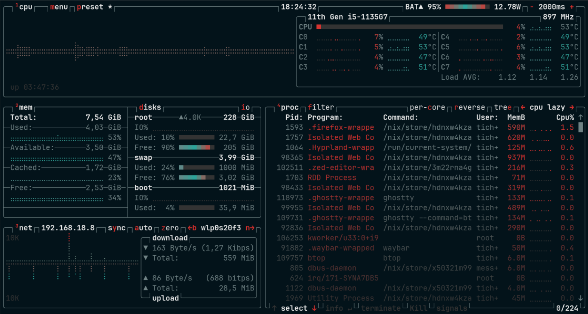

# 🏯 btop-solarized-osaka

A Solarized-inspired dark theme for **Btop++** using the color palette from *Solarized Osaka* (Neovim) by Takuya Matsuyama (GitHub: `craftzdog`).



---

## 🎨 About / More colors

Solarized Osaka is an enhancement of Ethan Schoonover’s original Solarized palette: it adds intermediary colors and brightens several base text colors for improved contrast on modern displays. This port brings that palette to Btop++, preserving the original hex color values where used and mapping them into Btop++ theme slots.

---

## ✨ Features

- Single `.theme` file for a direct drop-in install.
- Preserves exact Solarized Osaka color values used where appropriate.

---

## ⚡️ Requirements

- [Btop++](https://github.com/aristocratos/btop) (a modern fork of btop). For the best experience (truecolor/24-bit colors and latest fixes), use a recent btop/btop++ 1.x release.

---

## 📦 Installation

### 1. Clone this repository

```bash
git clone https://github.com/tichelmorres/btop-solarized-osaka-theme.git
cd btop-solarized-osaka-theme
```

### 2. Install to your user themes directory (recommended)

This creates the standard XDG config path for btop themes and copies the theme into the right location:

```bash
mkdir -p "${XDG_CONFIG_HOME:-$HOME/.config}"/btop/themes
cp themes/solarized-osaka.theme "${XDG_CONFIG_HOME:-$HOME/.config}"/btop/themes/
```

### 3. (Optional) Install system-wide

To make the theme available system-wide (i.e. for all users), copy the theme into one of btop's system theme locations (depends on how btop was installed):

- `/usr/local/share/btop/themes`
- `/usr/share/btop/themes`

Example (requires root):

```bash
# doas is also fine
sudo cp themes/solarized-osaka.theme /usr/local/share/btop/themes/
```

> Note: Some package managers place btop share files in non-standard locations. If btop does not detect a system-wide theme, check the package's `share` path and create a symlink if necessary.

### 4. Activate the theme

Edit (or create) your `btop.conf` (usually at `~/.config/btop/btop.conf`) and set the theme name (filename without `.theme`):

```toml
color_theme = "solarized-osaka"
truecolor = true           # recommended to preserve exact hex colors
# theme_background = true  # toggle to allow the theme to set a background color (set false if you want transparency)
```

Save the file and restart `btop`.

---

## ⚙️ Customizing colors

Btop++ theme files map colors to UI elements (bars, text, graphs, borders, etc.). To tweak:

1. Open `themes/solarized-osaka.theme` in a text editor.
2. Edit hex values (e.g. `#RRGGBB`) as you prefer.

---

## 🧾 Attribution & License

This Btop++ theme **reuses exact color values** from **Solarized Osaka** by Takuya Matsuyama (GitHub: `craftzdog`, YouTube: Devaslife). The original Neovim theme repo is licensed under the **Apache License 2.0**.

This repository is distributed under the Apache License 2.0 — see `LICENSE` for details.

---

*Thanks for using btop-solarized-osaka-theme. Feel free to open issues or PRs for fixes, additions, or theme variants.*
